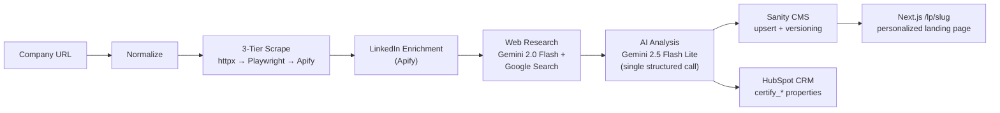
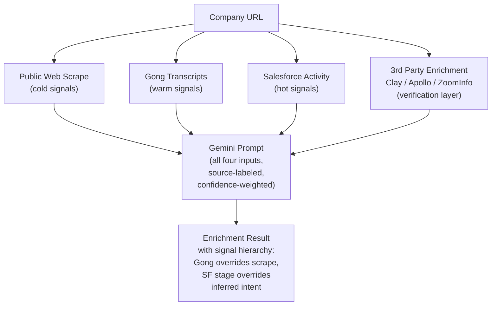

# Prism — Account Research to Personalized Content Pipeline

**Monorepo:** Python/FastAPI enrichment API, Next.js dashboard + personalized landing pages, Sanity CMS studio/schemas, HubSpot CRM custom company properties.

Given any company URL, Prism scrapes the public website, enriches via LinkedIn and open-web research, runs a single structured Gemini call that acts as both analyst and copywriter, writes page-ready content blocks into Sanity, and updates HubSpot with ICP scoring, intent signals, and a link to the rendered landing page. The output is a personalized landing page an SDR can drop into an outbound email within minutes of running the pipeline.

---

## Table of Contents

1. [Architecture](#architecture)
2. [Design Decisions](#design-decisions--what-was-built-and-why)
3. [Handling Blocked and Thin-Content Sites](#handling-blocked-and-thin-content-sites)
4. [Scaling to Hundreds of Accounts](#scaling-to-hundreds-of-accounts)
5. [Gong and Salesforce Integration](#how-gong-and-salesforce-would-augment-the-pipeline)
6. [Landing Page Rendering from Sanity](#landing-page-rendering-from-sanity)
7. [Measurement](#measurement--connecting-pipeline-to-revenue)
8. [Known Limitations](#known-limitations-and-future-improvements)
9. [Quick Start](#quick-start)
10. [Troubleshooting](#troubleshooting)

---

## Architecture



Each stage is independently resilient: a failure at any point triggers a dead-letter entry and graceful degradation rather than aborting the pipeline. The LinkedIn, web research, and AI stages all feed into the same structured `EnrichmentResult`, which is then written to both Sanity and HubSpot in parallel at the end.

**Key architectural principle:** the pipeline always writes *something* to both systems, even if upstream stages fail. A blocked scrape produces a low-confidence stub rather than silence. This means the CRM is never missing a record for a URL that was submitted, and the SDR always has visibility into what happened.

---

## Design Decisions — What Was Built and Why

### Single LLM call for analysis + content generation

**Decision:** One Gemini call performs ICP classification, intent signal detection, pain point mapping, *and* personalized content generation (hero headline, value prop, pain paragraph, CTA block) in a single pass.

**Why:** A two-call approach (analyze, then generate) doubles API cost and latency without meaningfully improving quality. The analysis context (which ICP tier, which pain points, which hook technique) is exactly what the content generation needs — splitting them forces redundant context in the second prompt. The single-call approach uses a detailed output schema with 25+ required fields, and Gemini's native JSON mode (`response_mime_type: application/json`) enforces structure without needing a second validation pass.

**What breaks:** If the prompt grows beyond ~8K input tokens (very content-rich sites), the model may truncate lower-priority output fields. The current mitigation is pre-processing each page to a 1,500-token budget before it reaches the LLM.

### Pre-processing before LLM

**Decision:** Raw HTML is never sent to the LLM. Each scraped page goes through `extract_clean_text_from_html` (strips nav, footers, scripts, cookie banners) and `summarize_page_for_llm` (keeps headings + first sentence per paragraph, capped at 1,500 tokens per page) before assembly into a structured JSON bundle.

**Why:** Passing raw HTML wastes tokens on markup that carries no intelligence value. Pre-processing produces a consistent input schema regardless of how different companies structure their websites — the LLM always receives the same field names (`homepage_text`, `about_text`, `career_titles`, `blog_excerpts`, `press_excerpts`) with quality metadata (`scrape_quality`, `pages_blocked`, `thin_content_pages`). This makes prompt engineering stable and reproducible.

### Gemini model selection

**Decision:** Gemini 2.5 Flash Lite for primary enrichment; Gemini 2.0 Flash with Google Search tool for open-web research.

**Why:** Flash Lite is cost-optimized for structured output tasks — at the scale of hundreds of accounts, the per-company cost stays under $0.02. The separate web research call uses Gemini 2.0 Flash because it supports Google Search grounding (tool use), which lets the model query live search results for news, funding, M&A, and hiring signals that aren't on the company's own website. This two-model approach gives the enrichment call access to both scraped website data *and* live open-web intelligence without requiring the primary model to have tool-use capabilities.

### Sanity document identity: `_id = account-{domain}`

**Decision:** Every company's Sanity document uses a deterministic `_id` derived from the domain, enabling idempotent `createOrReplace` mutations.

**Why:** Re-running the pipeline against the same URL overwrites the document rather than creating duplicates. Before overwriting, the previous version is snapshot into an `enrichmentVersion` document (linked via `account_reference`), preserving the full history of how a company's ICP score, intent signals, and content evolved over time. This versioning is critical for measuring whether re-enrichment produces meaningful signal drift — if a company's intent score jumps from 30 to 75 between runs, something changed (new funding round, new job postings) and that delta is itself an actionable signal.

The five `productPageContent` seed documents (`product-credentialing`, `product-licensing`, `product-compliance-monitoring`, `product-roster-management`, `product-provider-hub`) are auto-upserted in the same mutation batch to guarantee referential integrity for the `primary_product_fit` references.

### Flat HubSpot `certify_*` properties vs custom objects

**Decision:** All enrichment data is stored as flat custom properties on the Company record, prefixed with `certify_` to namespace cleanly.

**Why:** HubSpot's free tier does not support custom objects. Even on paid tiers, flat properties are more immediately useful for workflows, list segmentation, and reporting without requiring custom object setup. The `certify_` prefix means these properties coexist cleanly with any existing CRM properties, and an SDR can see the ICP tier, intent score, value prop, and landing page link directly on the company record without navigating to a related object.

**Tradeoff acknowledged:** This flattening means granular per-signal-type data (individual job posting titles, per-page scrape results) can't be stored in HubSpot. The full structured data lives in Sanity — HubSpot carries the summary scores and the SDR-facing content. The `certify_sanity_content_url` property links back to the Sanity document for anyone who needs the full dossier.

### 3-tier scraping escalation: httpx → Playwright → Apify

**Decision:** Start with the cheapest, fastest method and escalate only when needed.

**Why:** Most company websites serve static HTML that `httpx` handles in milliseconds. Playwright (headless Chromium) is only invoked when `is_js_rendered_hint` detects a JS-heavy page with fewer than 400 words of static content — this avoids spinning up a browser for sites that don't need it. Apify (managed Website Content Crawler with residential proxies) is the final escalation, triggered only when all pages are blocked or total scraped words fall below 120 — this handles Cloudflare-protected sites and aggressive bot detection at scale.

**Cost profile:** httpx is essentially free. Playwright adds ~2s of latency per page but no API cost. Apify costs ~$0.002/page but handles the hardest cases reliably. For a batch of 500 companies, the expected distribution is roughly 80% httpx, 15% Playwright, 5% Apify.

### LinkedIn enrichment via Apify

**Decision:** When an Apify token is configured, the pipeline resolves the company's LinkedIn page and scrapes the public company profile for additional firmographic signals.

**Why:** Company websites are often thin on the specific data points that matter for ICP scoring — employee count, geographic footprint, industry classification, specialties. LinkedIn company profiles are consistently structured and rich in these signals. The LinkedIn data is merged into the scrape bundle as `linkedin_data` and referenced by the Gemini prompt for higher-confidence classifications.

### Web research via Gemini + Google Search grounding

**Decision:** A separate Gemini 2.0 Flash call with Google Search tool access generates a structured dossier of open-web intelligence about the target company.

**Why:** The company's own website only tells one side of the story. News articles reveal funding rounds, M&A activity, geographic expansions, leadership changes, regulatory incidents, and competitive positioning — all high-value intent signals that scraping the website alone would miss. The web research dossier is passed as `web_research` in the enrichment prompt, letting the primary analysis cross-reference scraped data with external corroboration.

---

## Handling Blocked and Thin-Content Sites

The pipeline is designed around the assumption that real-world scraping will encounter messiness. Every failure mode degrades gracefully rather than crashing.

### Site blocks scraping (HTTP 403, 429, 503)

**Detection:** The HTTP scraper checks response status codes. A 403, 429, or 503 marks the page as blocked.

**Escalation chain:**
1. **Wayback Machine fallback** — immediately retries via `https://web.archive.org/web/{original_url}` using the same HTTP client. Cached snapshots are often sufficient for about/product pages that rarely change.
2. **Playwright headless browser** — if the page appears JS-rendered (detected via framework signatures in HTML and low static word count), Chromium renders the page with a 1,500ms wait for dynamic content.
3. **Apify Website Content Crawler** — if all pages are blocked or total words scraped fall below 120, the entire domain is handed to Apify's managed crawler with residential proxies, adaptive rendering, and anti-bot handling.
4. **Minimal stub** — if all fallbacks fail, the pipeline sets `scrape_quality = "blocked"` and `scrape_blocked = true`, then continues with the domain name as the only input to the LLM. The Gemini prompt is explicitly instructed to produce a low-confidence assessment without specific numeric claims when the input indicates a blocked or thin scrape.

### JavaScript-rendered sites with thin static HTML

**Detection:** `is_js_rendered_hint()` checks for JS framework signatures (React, Next.js, Vue, Angular meta tags or script patterns) combined with a body word count under 400.

**Handling:** Playwright renders the page with `domcontentloaded` wait + 1,500ms buffer for async data loading. If Playwright recovers meaningful content, the tier is upgraded to `"playwright"` and the extracted text replaces the thin static version.

### No careers page found

**Detection:** Link discovery and direct URL construction (`/careers`, `/jobs`, `/join-us`, `/open-positions`) both fail to locate a careers page.

**Impact:** The careers page is the single most valuable intent signal source — open credentialing/enrollment roles are a Tier-1 buying trigger. Its absence significantly reduces signal quality. The pipeline applies a **-15 point penalty** to `intent_score` and appends the adjustment rationale to `confidence_rationale`.

**Why this matters:** Without careers page data, the pipeline cannot detect whether the company is actively hiring credentialing coordinators (a strong buying signal) or mentions competitor tools in job descriptions. The intent score reduction ensures these companies are routed to nurture rather than immediate SDR outreach, preventing wasted rep time on incomplete intelligence.

### Thin or non-descriptive homepage

**Detection:** Pages with fewer than 150 words of extracted body text are flagged as thin content.

**Handling:** The scraper doesn't give up after the homepage — it crawls up to 14 URLs discovered via sitemap/robots.txt and direct URL construction for high-value paths (`/about`, `/company`, `/products`, `/services`, `/blog`, `/press`). Thin pages are still included as supplementary evidence but are not weighted as primary signals. The `scrape_quality` is downgraded to `"thin"` or `"medium"` based on the ratio of thin pages to total pages scraped.

### LLM returns invalid JSON

**Detection:** `parse_enrichment_json` attempts `json.loads` after stripping markdown code fences. If parsing fails, or required fields are missing, the response is flagged.

**Handling:** The parser is deliberately flexible — it handles alternate key casings (`painPoints` vs `pain_points`), coerces lists vs single dicts, and uses regex to extract structured IDs (e.g., `P1.1` pain IDs, `T1/T2/T3` signal tiers). If JSON is fundamentally malformed, the pipeline returns a minimal `EnrichmentResult` with `data_confidence = "failed"` and `requires_review = True`. This stub is still written to both Sanity and HubSpot — a failed enrichment is visible in the CRM as a record that needs manual attention, not silently dropped.

### Sanity / HubSpot API failures

**Handling:** All API writes use retry logic (Sanity: retries at 0, 2, 4, 8s intervals; HubSpot: single retry with field-stripping on `INVALID_OPTION` errors). On terminal failure, the enrichment JSON is persisted to `failed_writes/{timestamp}-{domain}.json` as a dead-letter entry. The API exposes `GET /api/dead-letter` and `POST /api/dead-letter/{id}/retry` endpoints for manual recovery. The pipeline continues past write failures and still marks the run as `"completed"` — inspect the `stages` array on each result for per-stage success/failure detail.

---

## Scaling to Hundreds of Accounts

### Concurrency model

The batch processor uses an `asyncio.Semaphore` with a configurable `BATCH_CONCURRENCY` limit (default: 3 parallel pipeline runs). Each pipeline run internally uses `asyncio.to_thread` for blocking operations (Gemini API calls, Apify actors, LinkedIn resolution) to avoid starving the event loop.

For a batch of 500 URLs at concurrency 3, expected wall-clock time is roughly 2-3 hours (dominated by scraping and Gemini latency per company). Increasing concurrency to 10 would cut this proportionally, subject to API rate limits.

### Scraping rate limits

The httpx client is configured with `max_connections=20` and `max_keepalive_connections=10`. URL discovery prioritizes and deduplicates to cap at 14 URLs per domain, preventing unbounded crawling. For Apify-escalated sites, the managed crawler handles its own proxy rotation and rate limiting internally.

At 500 companies x ~10 pages each = ~5,000 HTTP requests, the primary bottleneck is per-domain politeness, not aggregate throughput. The pipeline processes companies in parallel (not pages within a company), so per-domain rate limiting is naturally satisfied.

### LLM throughput

Each company produces one Gemini enrichment call (~3,000-5,000 input tokens, ~2,000 output tokens) plus one optional web research call. At concurrency 3, this generates ~6 API calls in flight at any time — well within Gemini's rate limits for standard API keys. The `asyncio.to_thread` wrapper ensures the synchronous `google-generativeai` SDK doesn't block the event loop.

For bulk runs exceeding 1,000 companies, Gemini's Batch API would reduce cost by ~50% by processing requests asynchronously at lower priority. The pipeline architecture (decoupled scrape → enrich → write stages) already supports this — the enrichment stage could be swapped to batch mode without changing the scraping or writing stages.

### HubSpot API limits

HubSpot limits API calls to 100 requests per 10 seconds on free/starter tiers. The current pipeline makes 2 calls per company (search + create/update). For 500 companies, this requires ~17 minutes of API time at the rate limit ceiling. For larger batches, HubSpot's batch create/update endpoints support up to 100 objects per call — reducing 500 companies to 5 batch calls plus 5 search calls.

### Cost estimates

| Component | Per-company cost | 500-company batch |
|-----------|-----------------|-------------------|
| Scraping (httpx/Playwright) | ~$0 | ~$0 |
| Scraping (Apify, ~5% of sites) | ~$0.002 | ~$0.50 |
| LinkedIn enrichment (Apify) | ~$0.003 | ~$1.50 |
| Web research (Gemini 2.0 Flash) | ~$0.003 | ~$1.50 |
| AI enrichment (Gemini 2.5 Flash Lite) | ~$0.008 | ~$4.00 |
| Sanity writes | negligible (free tier) | $0 |
| HubSpot writes | negligible (API-based) | $0 |
| **Total** | **~$0.01–0.02** | **~$5–8** |

### What breaks first at scale

1. **Apify costs** — if a large percentage of target sites require the Apify escalation tier, costs scale linearly. Mitigation: cache scrape results and skip re-scraping domains enriched within 30 days.
2. **Gemini rate limits** — sustained throughput above ~60 requests/minute may hit quota. Mitigation: implement a token-aware queue that estimates input tokens before queuing and regulates throughput.
3. **Storage** — pipeline run results are stored as JSON files on disk (`storage/`). At 10,000+ runs, this should migrate to a database. The current approach is deliberately simple for the PoC.

---

## How Gong and Salesforce Would Augment the Pipeline

The current pipeline produces a cold-start intelligence profile from public data. The transformative enhancement is layering in warm signals from Gong call transcripts and hot signals from Salesforce activity data.

### Gong call transcript integration

**What Gong provides:** When a prospect has had calls recorded in Gong, the transcript contains the exact words the buyer used to describe their pain, the objections they raised, the competitors they mentioned, and the decision timeline they implied. This is the highest-value intelligence available — and it's currently invisible to the scrape-only pipeline.

**How to integrate:** Pull Gong call transcripts via the Gong API (`/v2/calls` and `/v2/calls/{callId}/transcript`) filtered by company domain. For each company in the pipeline, retrieve the 3 most recent calls where a participant's email domain matches the target. Pass transcript excerpts (or Gong's own AI summaries) as a `gong_signals` input alongside the scraped data in the Gemini prompt.

**What this changes in the output:**
- **Pain points shift from inferred to verbatim.** If a VP of Operations said "we're spending 40 hours a week cleaning delegated rosters," that first-person statement overrides any inferred pain severity from website language.
- **Objections inform the CTA block.** If the company previously objected to price, the CTA should lead with ROI framing rather than feature depth.
- **Decision timeline gives urgency.** "We need NCQA certification by Q3" is a time-bounded signal that scraping can never produce — it should elevate the intent score and trigger immediate SDR routing.
- **Competitor mentions are confirmed, not inferred.** A call where the prospect says "we're evaluating Medallion" is qualitatively different from inferring competitor use from a job description.

**Data model addition (Sanity + HubSpot):**
```
gong_signals:
  gong_calls_available: boolean
  gong_last_call_date: datetime
  gong_verbatim_pain_statements: string[]
  gong_objections_raised: string[]
  gong_competitors_mentioned: string[]
  gong_decision_timeline: string
  gong_buyer_sentiment: string
```

The existing Sanity schema and HubSpot property group are structured so that adding these fields requires no migration — they extend the `accountResearchProfile` document and the `certify_*` property namespace without breaking the scrape-only path.

### Salesforce activity data integration

**What Salesforce provides:** Opportunity stage history, deal age, contact engagement history, past contract details for existing customers, and the structured record of every touchpoint the sales team has had with the account.

**How to integrate:** Query Salesforce via SOQL for the Account object matching the domain. Pull: opportunity stage and age, last activity date, contact titles, and any past contracts or churned customer status.

**What this changes in the output:**
- **Existing customers switch to expansion mode.** The content blocks should reference products they don't yet use, not the ones they have.
- **Open opportunities get deal acceleration content.** If a company is in "Proposal Sent" stage, the CTA should be "Questions about the proposal?" not "Book a demo."
- **Closed-lost accounts get re-engagement framing.** The pipeline notes the lost reason (if captured) and adjusts content to address the specific objection.
- **Deal velocity + Gong sentiment = deal health.** Stalled deals get different nurture content than companies in active evaluation.

**Data model addition:**
```
salesforce_signals:
  sf_account_id: string
  sf_open_opportunity: boolean
  sf_opportunity_stage: string
  sf_opportunity_age_days: number
  sf_last_activity_date: datetime
  sf_is_existing_customer: boolean
  sf_products_purchased: string[]
  sf_closed_lost_reason: string
```

### Combined signal architecture (future state)

In the mature pipeline, each company URL triggers a four-source enrichment:



Signals from Gong override inferences from scraping. Salesforce stage overrides inferred buying intent. The resulting content blocks reflect the full relationship context, not just what's publicly visible. The current PoC's data model is designed to accommodate this evolution without a schema migration — the `gong_signals` and `salesforce_signals` fields can be added as optional extensions to the existing document types.

---

## Landing Page Rendering from Sanity

The Sanity document is not just a storage layer — it is the content source for dynamically rendered, account-specific landing pages that SDRs include in outbound emails.

### How it works

Each company gets a landing page at `/lp/{slug}` (e.g., `/lp/example-health-com`). The route is a Next.js server component that queries the Sanity Content Lake at request time for the matching `accountResearchProfile` document.

**GROQ query:**
```groq
*[_type == "accountResearchProfile" && domain == $domain][0]{
  company_name,
  domain,
  organization_type,
  pain_points,
  intent_signals,
  content_blocks,
  primary_product_fit,
  "product_details": primary_product_fit[]->{
    product_name,
    hero_copy,
    proof_points
  }
}
```

### Page template assembly

The landing page composes five sections from the enrichment data:

1. **Hero section** — `content_blocks.hero_headline` and `content_blocks.personalized_value_proposition`, personalized to reflect the company's specific operational context.
2. **Pain section** — `content_blocks.pain_point_paragraph` plus the detected `pain_points` array with severity levels and evidence.
3. **Social proof section** — CertifyOS case studies and metrics matched by `organization_type` (health plan companies see health plan customer testimonials; digital health companies see digital health success metrics).
4. **Product section** — Feature details pulled from the first resolved `productPageContent` document referenced in `primary_product_fit`, ensuring the product pitch matches the company's primary pain.
5. **CTA section** — `content_blocks.cta_block` with personalized CTA text, subtext, and a supporting proof point.

### URL design and access control

**Slug format:** The domain is converted to a hyphenated slug (`example.com` → `example-com`). This is human-readable but not easily guessable — a prospect can't enumerate other companies' landing pages.

**Optional HMAC token:** When `LANDING_PAGE_SECRET` is set, pages require a `?t={token}` parameter. The token is an HMAC-SHA256 of the slug with the secret (first 20 hex characters). If no secret is set, all pages are publicly accessible. This lets teams gate pages during internal review and selectively share live links.

**Preview mode:** Appending `?preview=true` renders the page with a "Draft — Internal Preview Only" banner, letting SDRs verify the personalization before including the URL in outreach.

### The rendering trigger

The pipeline writes `certify_sanity_content_url` and the landing page URL to the HubSpot company record. The SDR includes this URL in their outbound email. When the prospect clicks the link, they land on a page that feels built specifically for them — because the intelligence layer made it so.

---

## Measurement — Connecting Pipeline to Revenue

A pipeline that generates personalized content is only valuable if it impacts pipeline and revenue. The measurement framework connects pipeline operations to business outcomes across three dimensions.

### Pipeline quality metrics

- **Outbound reply rate:** Compare reply rates for emails that include a personalized landing page URL vs. generic outbound. Target: 2-3x lift over cold outreach baseline.
- **Meeting booked rate:** Track meetings booked from accounts enriched by the pipeline. Segment by ICP tier to validate scoring accuracy.
- **ICP tier-to-opportunity conversion:** Of companies scored Tier A, what percentage convert to qualified opportunities? Target: >=50%. If it's 20%, the scoring model is overweighting the wrong signals and the prompt needs refinement.

### Content quality metrics

- **SDR acceptance rate:** What percentage of AI-generated value props and headlines do SDRs send as-is vs. editing significantly? Low acceptance = prompt engineering needs iteration. Over time, the delta between the LLM's output and the SDR's edit becomes training data for prompt refinement.
- **Landing page engagement:** Time on page, scroll depth, and CTA click rate for pipeline-generated pages vs. generic pages.
- **A/B testing:** Same SDR email template with and without the personalized landing page link, controlling for ICP tier and rep quality.

### Data quality metrics

- **Intent signal predictive value:** Of companies with Tier-1 signals (open credentialing roles, geographic expansion, recent funding), what percentage book a meeting within 30 days of outreach? This validates the signal definitions and their tier assignments.
- **Re-enrichment drift:** Do companies re-enriched 90 days later show meaningfully changed ICP scores or new intent signals? The `enrichmentVersion` snapshots in Sanity enable this comparison. Meaningful drift validates the monitoring cadence; no drift suggests the re-enrichment interval can be extended.
- **Hook technique performance by ICP type:** Sanity tracks `hook_technique_used` on every enrichment. Combining this with CRM conversion data reveals which hooks work for which ICP types — regulatory guillotine may convert health plans while revenue leakage calculator converts digital health. This insight makes the prompt smarter over time.

### Feedback loops

1. **SDR edit tracking:** When an SDR modifies `certify_personalized_value_prop` in HubSpot before sending, the original and edited versions create implicit preference data for prompt refinement.
2. **Closed-won attribution:** When a deal closes, pull the account's enrichment history from Sanity. Identify which signals were present at first outreach. Over 50+ deals, patterns emerge — the signals most predictive of close become the highest-weighted in the ICP scoring formula.
3. **Content variant performance:** Track which `hook_technique_used` variants (regulatory guillotine, competitive clock, hiring intercept, etc.) correlate with higher reply rates per ICP segment. Feed winning patterns back into the prompt as preferred techniques for each organization type.

---

## Known Limitations and Future Improvements

- **LinkedIn / third-party enrichment is best-effort.** LinkedIn scraping via Apify depends on the actor's ability to resolve and access the company page. No ZoomInfo/Apollo/Clay verification layer is implemented.
- **No continuous re-enrichment trigger.** Re-enrichment is manual (re-submit the URL). A production system would schedule re-enrichment every 90 days for non-customer accounts and trigger immediate re-enrichment on HubSpot lifecycle stage changes.
- **Content requires human review.** The personalized content blocks are LLM-generated and should be reviewed by an SDR before external use. The `requires_review` flag and `data_confidence` levels help prioritize which accounts need more attention.
- **Provider count estimation is imprecise.** For companies that don't explicitly state their network size, the LLM infers from indirect signals (language like "hundreds of providers," employee count proxies). This inference is flagged in `confidence_rationale`.
- **HubSpot workflows are not automated in the PoC.** The `certify_*` properties support workflow triggers (Tier-A SDR alert, Tier-B nurture enrollment, 90-day re-enrichment reminder), but these must be configured in the HubSpot UI.
- **Social proof on landing pages is static.** The social proof section uses hardcoded case studies matched by organization type rather than pulling from a dynamic Sanity collection.
- **Landing page preview is cosmetic.** The `?preview=true` flag adds a visual banner but doesn't use Sanity's draft/preview API. Both preview and live pages render the same published content.

---

## Quick Start

1. Copy [`.env.example`](.env.example) → `.env` and fill secrets.
2. `chmod +x setup.sh && ./setup.sh` (local venv + npm installs), **or** `docker compose up --build`.
3. **One-time setup (with tokens in `.env`):**
   - `curl -X POST http://localhost:8000/api/setup/hubspot` — create `certify_*` properties.
   - `curl -X POST http://localhost:8000/api/setup/sanity` — seed `productPageContent` docs.
4. Open **http://localhost:3000** — submit a URL or CSV batch.
5. Sanity Studio: **http://localhost:3333** (see `docker-compose`).
6. API docs: **http://localhost:8000/docs**.

### Landing pages

- URL pattern: `/lp/{domain-with-hyphens}` (e.g., `/lp/example-health-com`).
- Preview banner: `?preview=true`.
- Optional shared secret: set `LANDING_PAGE_SECRET` and open `/lp/{slug}?t={hmac}` (see [`frontend/src/lib/landing-token.ts`](frontend/src/lib/landing-token.ts)).

---

## Troubleshooting

### Sanity `409` — `documentReferenceDoesNotExistError`

Account docs reference `productPageContent` IDs. The pipeline auto-seeds those five product documents in the same mutation batch, so a fresh pull should fix this without running setup manually. If you still see 409s, confirm `SANITY_PROJECT_ID` / `SANITY_DATASET` match the project where you expect data.

### HubSpot `401` / `EXPIRED_AUTHENTICATION` with `1970-01-01`

Usually means `HUBSPOT_ACCESS_TOKEN` is missing, wrong, or not a Private App token. Use a current token from **Settings → Integrations → Private Apps** (starts with `pat-`). Remove quotes/spaces in `.env`, restart uvicorn.

---

## License

Apache-2.0 (see [LICENSE](LICENSE)).
